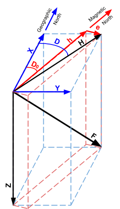

Algorithm Theoretical Basis for &ldquo;Geomag XYZ&rdquo;

E. Joshua Rigler &lt;[erigler@usgs.gov](mailto:erigler@usgs.gov)&gt;

# Summary

Mathematical underpinnings and general algorithm considerations are presented for converting geomagnetic observations from so-called HEZ coordinates, used by the USGS geomagnetism program, into XYZ coordinates, used by a growing number of international geomagnetism programs, as well as various academic and commercial entities. Inverse transformations are also provided.

# Background and Motivation

Historically, the most common coordinate system used to specify measured geomagnetic fields has been HDZ, where: 

1.  H is the magnitude of the geomagnetic field vector tangential to the Earth&rsquo;s surface;
2.  D is the declination, or clockwise angle from the vector pointing to the geographic north pole to the H vector;
3.  Z is the downward component of the geomagnetic field.

This coordinate system is useful for navigation (it is the natural coordinate system for a magnetic compass), and any scientific analysis conducted in a geomagnetic field-aligned reference frame, but is somewhat awkward for most other applications. A more generally useful set of coordinates for scientific analysis and engineering applications is the XYZ system:

1.  X points to the geographic north pole;
2.  Y points eastward;
3.  Z, as before, points downward.

Conversion between these two coordinate systems involves relatively straight-forward trigonometry (see Eqs. 1, 2, and 3). However, in practice, a 3-axis magnetometer necessarily takes on a fixed orientation upon installation. For USGS observatories, this is aligned with the average magnetic north vector and downward, with the final axis completes a right-handed 3-dimensional coordinate system (roughly eastward). &nbsp;This is often referred to as HEZ coordinates, but for the remainder of this document we will refer to it as heZ, to avoid confusion with more traditional definitions of H and E(==Y).

The purpose of this document then is to provide a mathematical and algorithmic description of how one converts data measured in heZ coordinates to true HDZ, and finally to XYZ.

# Math and Theory

First, following definitions in the previous section, the conversion from cylindrical HDZ to Cartesian XYZ is very straight-forward trigonometry:

<table cellpadding="0" cellspacing="0" class="c14"><tbody><tr class="c5"><td class="c10" colspan="1" rowspan="1">

</td><td class="c12" colspan="1" rowspan="1">

(1)
</td></tr><tr class="c5"><td class="c10" colspan="1" rowspan="1">

</td><td class="c12" colspan="1" rowspan="1">

(2)
</td></tr><tr class="c5"><td class="c10" colspan="1" rowspan="1">

</td><td class="c12" colspan="1" rowspan="1">

(3)
</td></tr></tbody></table>

However, as noted previously, the USGS aligns its magnetometers with the magnetic north upon installation at an observatory, meaning raw data is generated in heZ coordinates, where &ldquo;h&rdquo; is is the primary axis in a fixed reference frame, &ldquo;e&rdquo; is the secondary axis in this reference frame, and &ldquo;Z&rdquo; is the tertiary axis, which remains common for all reference frames discussed in this document.

The figure to the right illustrates how the same full magnetic field vector F, can be represented in heZ, HDZ, and XYZ coordinates. Red objects are specific to the magnetometer&rsquo;s reference frame, while blue objects are specific to the geographic reference frame. Black is common to all frames considered here, and dashed lines help define Cartesian grids.

One thing that is not labeled in this figure is the angle d (see Eq. 4), which is the difference between declination D, and a declination baseline (D0, or DECBAS).

Equations 4, 5, and 6 describe how to convert the horizontal components of a USGS magnetometer&rsquo;s raw data element into more standard H and D components.

<table cellpadding="0" cellspacing="0" class="c14"><tbody><tr class="c5"><td class="c10" colspan="1" rowspan="1">

</td><td class="c12" colspan="1" rowspan="1">

(4)
</td></tr><tr class="c5"><td class="c10" colspan="1" rowspan="1">

</td><td class="c12" colspan="1" rowspan="1">

(5)
</td></tr><tr class="c5"><td class="c10" colspan="1" rowspan="1">

</td><td class="c12" colspan="1" rowspan="1">

(6)
</td></tr></tbody></table>

To inverse transform from XY to HD:

<table cellpadding="0" cellspacing="0" class="c14"><tbody><tr class="c5"><td class="c10" colspan="1" rowspan="1">

</td><td class="c12" colspan="1" rowspan="1">

(7)
</td></tr><tr class="c5"><td class="c10" colspan="1" rowspan="1">

</td><td class="c12" colspan="1" rowspan="1">

(8)
</td></tr></tbody></table>

...and from HD to he:

<table cellpadding="0" cellspacing="0" class="c14"><tbody><tr class="c5"><td class="c10" colspan="1" rowspan="1">

</td><td class="c12" colspan="1" rowspan="1">

(9)
</td></tr><tr class="c5"><td class="c10" colspan="1" rowspan="1">

</td><td class="c12" colspan="1" rowspan="1">

(10)
</td></tr><tr class="c5"><td class="c10" colspan="1" rowspan="1">

</td><td class="c12" colspan="1" rowspan="1">

(11)
</td></tr></tbody></table>

It is worth noting that there is potential for mathematically undefined results in several of the preceding equations, where infinite ratios are a possible argument to the arctan() function. However, Python&rsquo;s Numpy package, and indeed most modern math libraries, will return reasonable answers in such situations (hint: arctan(Inf)==pi/2).

# Algorithm&nbsp;Considerations

## Magnetic Intensity Units

It is understood that all raw data inputs are provided in units of nanoTesla (nT). Of course this is not required for the equations to be valid, but it is incumbent on the programmer to make sure all input data units are the same, and that output units are defined accurately.

## Declination Angular Units

The equations in the preceding section are relatively simple to code up, with the standard caveat that angles must be appropriate for the trigonometric functions (e.g., if sin/cos/tan expect radians, be sure to provide parameters in radians). One thing that can potentially complicate this is that IAGA standards require declination angles to be in minutes of arc. Furthermore, D0&nbsp;(DECBAS)[[a]](#cmnt1)[[b]](#cmnt2)&nbsp;is not very well-defined by IAGA standards, but is typically reported in tenths of minutes of arc. None of these are difficult to convert, but it is incumbent on the programmer to make sure they know what units are being used for the inputs.

## Declination Baseline

Declination baseline is not well-defined by IAGA standards. The typical method used to publish it with actual data is to include it in the metadata. For older IMF formatted files, it is part of the periodic block header. For IAGA2002 formatted file, it may&nbsp;be in the file header, but is not required. To the best of my knowledge, if it is not included, one should assume it is zero, but no corroborating documentation could be found to justify this statement.

## Declination in USGS Variations Data

The&nbsp;USGS variations data is actually published in hdZ coordinates. If one wishes to apply equations in the preceding section to USGS variations data, they must first convert &ldquo;d&rdquo; back into &ldquo;e&rdquo; via Eq. 11.

## Data Flags

It should go without saying that bad data in one coordinate system is bad data in another. However, on occasion, operational USGS Geomagnetism Program code has been discovered where coordinate transformations were applied before&nbsp;checking data flags. This is not an issue if data flags are NaN (not-a-number values), but more typical for Geomag data, these are values like 99999, which can lead to seemingly valid, but erroneous values at times when the raw data were known to be bad.[[c]](#cmnt3)[[d]](#cmnt4)[[e]](#cmnt5)[[f]](#cmnt6)

[[a]](#cmnt_ref1)How is this value computed? &nbsp;Is it something that would be configured in advance, or best computed dynamically?

[[b]](#cmnt_ref2)Good question.

To date, I have simply extracted it from the header of the text files we publish Online. But Hal tells me it is not actually stored in any database currently, but hard-coded or included in a config file somewhere. He or Duff Stewart are probably needed to answer this question more confidently.

For this XYZ algorithm it is more-or-less assumed that DECBAS is a quasi-static value, but in the future this may change.

[[c]](#cmnt_ref3)Is the preferred algorithm output NaN, which can (when needed) be replaced with a placeholder value such as 99999?

[[d]](#cmnt_ref4)Another good question. The official data products are required to use 99999 (or in some cases 88888), but if output is some kind of intermediate product, it might make more sense to use NaNs, and simply replace these with 9s when the text files are generated.

[[e]](#cmnt_ref5)That makes the most sense to me. It should be the job of the module creating the text file to replace the NaNs with the accepted value for that type of file.

[[f]](#cmnt_ref6)that&#39;s the route we&#39;re planning to go

</body></html>
