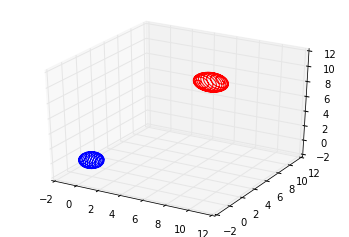

Adjusted Algorithm
=============

Algorithm Theoretical Basis for "Geomag Adjusted"

Abram Claycomb &lt;[aclaycomb@usgs.gov](mailto:aclaycomb@usgs.gov)&gt;

## Summary

Mathematical underpinnings and general algorithm considerations are presented for converting geomagnetic observations from so-called HEZ coordinates, provided by the vector variation magnetometer (commonly referred  to as the fluxgate), into XYZ coordinates, using absolute magnetic field direction measurements collected on a theodolite, combined with total field (directionless or scalar) measurements, and pier correction measurements, or the measurement of total field difference between the absolutes pier and the vector magnetometer pier (or somewhere closer to it).

## Background and Motivation

Historically, the most common coordinate system used to specify measured
geomagnetic fields has been HDZ, where:

- `H` is the magnitude of the geomagnetic field vector tangential to the
  Earth's surface;
- `D` is the declination, or clockwise angle from the vector pointing to the
  geographic north pole to the H vector;
- `Z` is the downward component of the geomagnetic field.

This coordinate system is useful for navigation (it is the natural coordinate
system for a magnetic compass), and any scientific analysis conducted in a
geomagnetic field-aligned reference frame, but is somewhat awkward for most
other applications.  This is the coordinate system that ordinate (vector magnetometer) hez coordinates are converted to before computing baselines.  Note: Z is meant to be downward, but the instrument can be misaligned vertically.  There is a system in place to reduce drift of the sensor axis, but it is not perfect.

hez is defined as:

- `h` is the measurement of the magnetic field vector projected on the axis placed generally pointing magnetically north and as close to level as practical.
- `e` is the measurement of the magnetic field vector projected on an axis orthogonal to h, also as close to level as practical, generally magnetically east at the time of installation.
- `z` is the measurement of the magnetic field vector projected onto the axis aligned with the local gravity vector (again aligned as close as practical at time of installation).

A more generally useful set of coordinates for scientific
analysis and engineering applications is the XYZ system:

-  `X` is the magnitude of the geographic north pole component of the H vector;
-  `Y` is the magnitude of the east component of the H vector;
-  `Z` is the downward component of the geomagnetic field

> Note: leveling of theodolite and survey of pier and mark affect absolute measurements.

A possible observatory configuration is shown below:

Conversion between these two coordinate systems involves relatively straight-
forward trigonometry (see [Eq. 1](#eq1), [Eq. 2](#eq2), and [Eq. 3](#eq3)).

However, in practice, a 3-axis
magnetometer necessarily takes on a fixed orientation upon installation. For
USGS observatories, this is aligned with the average magnetic north vector and
downward, with the final axis completes a right-handed 3-dimensional coordinate
system (roughly eastward). This is often referred to as HEZ coordinates, but
for the remainder of this document we will refer to it as hez, to avoid
confusion with more traditional definitions of H and E(==Y).

The purpose of this document then is to provide a mathematical and algorithmic
description of how one converts data measured in hez coordinates to to sensor-aligned HDz (ordinates), measures/computes absolutes as (F+pier_correction,D,I), where I is inclination, converts to HDZ at the pier, subtracts the absolute HDZ from the ordinate HDz to arrive at baselines.  Baselines are measured once or twice a week, but the vector difference is applied currently to minutes data in quasi-definitive and definitive data processing.  

The data is processed by
adding the baselines delta H, delta D, and delta Z, to the HDz coordinates (obtained by simple trigonometry) of the vector magnetometer, to obtain north - east - down aligned HDZ at the absolutes pier, then the final HDZ are converted to XYZ by simple trigonometry.

Adjusted Phase 1 maps from hez coordinates, arbitrarily oriented, to  XYZ coordinates, oriented North - East - Down (subject leveling and surveying error at the pier) with a linear, affine transformation of the form:

- [X,Y,Z] = [M] * [H,E,Z]

## Math and Theory

First, following definitions in the previous section, the conversion from
cylindrical HDZ to Cartesian XYZ is very straight-forward trigonometry:

- Equation 1: `X = H cos(D)`
- Equation 2: `Y = H sin(D)`
- Equation 3: `Z = Z`

However, as noted previously, the USGS aligns its magnetometers with the
magnetic north upon installation at an observatory, meaning raw data is
generated in heZ coordinates, where "h" is is the primary axis in a fixed
reference frame, "e" is the secondary axis in this reference frame, and "Z" is
the tertiary axis, meant to be vertically down.

The figure above illustrates how the same full magnetic field vector **F**, can
be represented in heZ, HDZ, and XYZ coordinates. Red objects are specific to
the magnetometer's reference frame, while blue objects are specific to the
geographic reference frame. Black is common to all frames considered here, and
dashed lines help define Cartesian grids.

One thing that is not labeled in this figure is the angle d (see [Eq. 4](#eq4)),
which is the difference between declination D, and a declination
baseline (D0, or DECBAS).

The equations [Eq. 4](#eq4), [Eq. 5](#eq5), [Eq. 6](#eq6) describe how to
convert the horizontal components of a USGS magnetometer's raw data element
into more standard H and D components.

- Equation 4: `d = arctan(e/h)`
- Equation 5: `D = D0 + d`
- Equation 6: `H = sqrt(h*h + e*e) = h / cos(d)`

To inverse transform from `XY` to `HD`:

- Equation 7: `H = sqrt(X*X + Y*Y)`
- Equation 8: `D = arctan(Y/X)`

...and from `HD` to `he`:

- Equation  9: `d = D - D0`
- Equation 10:
  `h = sqrt(H*H / (1 + tan(d)*tan(d))) = H cos(d)`
- Equation 11: `e = h * tan(d)`

It is worth noting that there is potential for mathematically undefined results
in several of the preceding equations, where infinite ratios are a possible
argument to the arctan() function. However, Python's Numpy package, and indeed
most modern math libraries, will return reasonable answers in such situations
(hint: arctan(Inf)==pi/2).

> Note: this library uses the atan2 function to handle the noted problem of
> infinite ratios.

## Practical Considerations

### Magnetic Intensity Units

It is understood that all raw data inputs are provided in units of nanoTesla
(nT). Of course this is not required for the equations to be valid, but it is
incumbent on the programmer to make sure all input data units are the same, and
that output units are defined accurately.

### Declination Angular Units

The equations in the preceding section are relatively simple to code up, with
the standard caveat that angles must be appropriate for the trigonometric
functions (e.g., if sin/cos/tan expect radians, be sure to provide parameters
in radians). One thing that can potentially complicate this is that IAGA
standards require declination angles to be in minutes of arc. Furthermore, D0
(DECBAS) is not very well-defined by IAGA standards, but is typically reported
in tenths of minutes of arc. None of these are difficult to convert, but it is
incumbent on the programmer to make sure they know what units are being used
for the inputs.

> Note: this library internally uses radians for all angles, and factories
> convert to and from this standard.

### Declination Baseline

Declination baseline is not well-defined by IAGA standards. The typical method
used to publish it with actual data is to include it in the metadata. For older
IMF formatted files, it is part of the periodic block header. For IAGA2002
formatted file, it may be in the file header, but is not required. To the
best of my knowledge, if it is not included, one should assume it is zero, but
no corroborating documentation could be found to justify this statement.

> Note: this library makes declination baseline available in trace stats as
> `declination_base` ([see all trace metadata](./metadata.md).  The IAGA Factory
> also attempts to parse DECBAS from the comments section.

### Declination in USGS Variations Data

The USGS variations data is actually published in hdZ coordinates. If one
wishes to apply equations in the preceding section to USGS variations data,
they must first convert "d" back into "e" via [Eq. 11](#eq11).

### Data Flags

It should go without saying that bad data in one coordinate system is bad data
in another. However, on occasion, operational USGS Geomagnetism Program code has
been discovered where coordinate transformations were applied
before checking data flags. This is not an issue if data flags are NaN
(not-a-number values), but more typical for Geomag data, these are values like
99999, which can lead to seemingly valid, but erroneous values at times when the
raw data were known to be bad.
